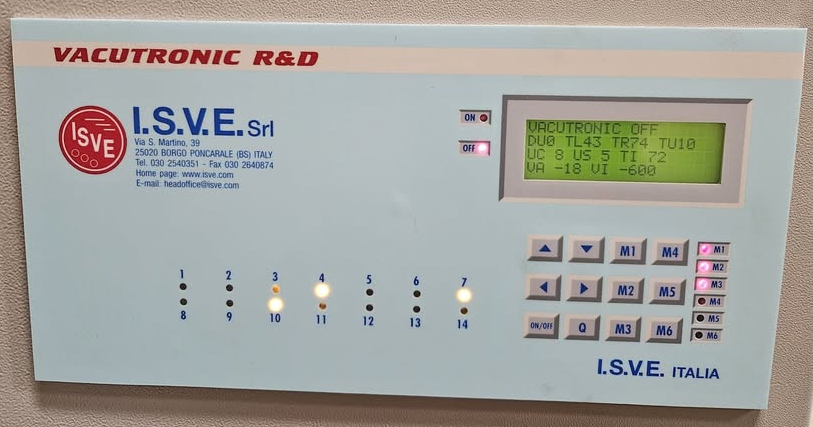
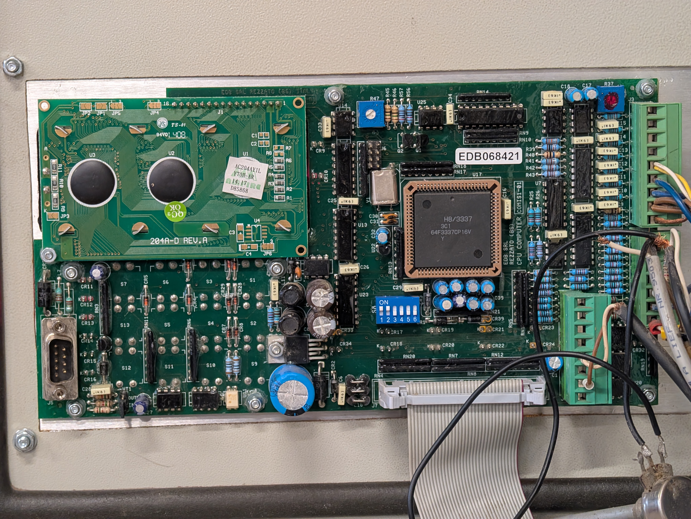
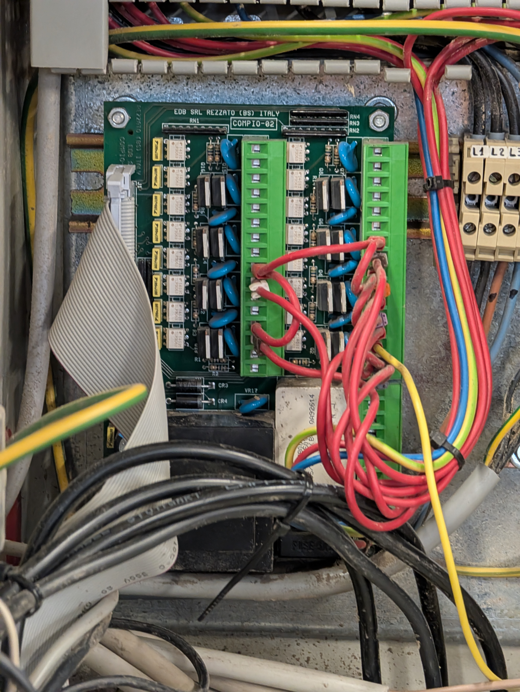

# Vacutronic Wood Drying Kiln Controller

This repo is a collection of bits and pieces that I've managed to scrape together, 
about the Vacutronic R&D wood drying kiln controller, by the Italian company I.S.V.E.
The information is mostly gone from their website, but I found some manuals in the internet archive,
and I got the English manual from the company directly. They also sent me a related wiring scheme,
for an ES3 wood drying kiln, built in 2011, which is similar to mine and uses the controller.

The manual also refers to some PC software, but I haven't been able to obtain it yet.

> I am not affiliated with I.S.V.E. in any way, but the company seems to have abandoned the product,
> so I hope that this information can be useful to other people

If you have any information don't hesitate to contact me, or to open an issue or a pull request in this repo.

## Images
Controller front panel:
 

Controller PCB:
 

Output board:
 
